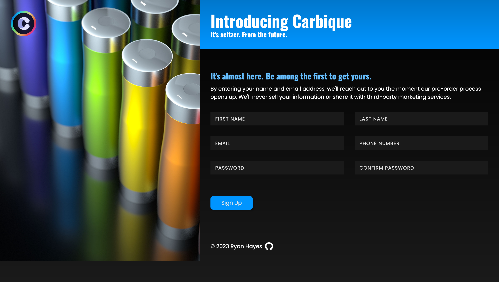

# The Odin Project - Sign Up Form

## Table of contents

- [Overview](#overview)
  - [The goal](#the-goal)
  - [Preview](#preview)
  - [Live Site](#live-site)
- [My process](#my-process)
  - [Built with](#built-with)
  - [Features](#features)
  - [Outcome](#outcome)
  - [What I learned](#what-i-learned)
  - [Continued development](#continued-development)
  - [Proud of](#proud-of)
  - [Useful resources](#useful-resources)
- [Author](#author)

### The goal 

The goal of the project was to make sign-up form for an imaginary service. 

### Preview

### Live set

[Sign Up Form](https://ryanthayes.github.io/top-sign-up-form/)

## My process

### Built With

   
   

### Features

- Responsive for both Desktop & Mobile

### Outcome

- Used HTML5 **semantic elements** for better readability and structure
- Used CSS3 **grid** and **flex** to manage layout
- Used **Git** and **GitHub** for project management
- **Cross tested** on Firefox and Chromium based browsers

### What I learned

- How to use **CSS Animation** to animate form elements.

### Proud of

### Useful resources

[Input Animations With HTML And CSS](https://www.youtube.com/watch?v=IxRJ8vplzAo)

## Author

